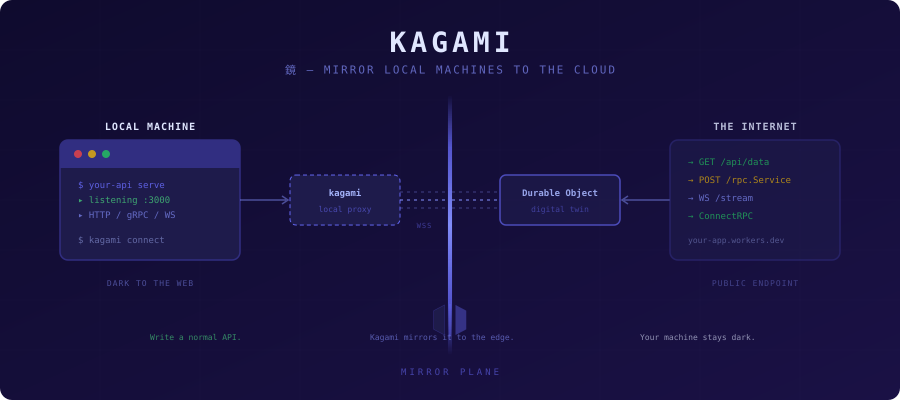

<p align="center">
  
</p>

# Kagami

Kagami ("mirror" in Japanese) mirrors local APIs to the internet without exposing your machine. A lightweight Go agent connects outbound via WebSocket to a Cloudflare Durable Object that acts as a "digital twin." External HTTP requests hit the DO, get relayed to the agent, and the agent proxies them to your local services. No open ports, no custom WebSocket code.

The Cloudflare-side components ship as an **NPM package** — install it, wire it into your Hono Worker, and you're done. Each deployment gets its own machine registry backed by D1, with per-machine secrets for authentication.

## How It Works

```
External HTTP Request
        │
        ▼
┌──────────────────────┐
│  Your Cloudflare     │
│  Worker (Hono)       │
│  + kagami package    │──── D1 (machine registry)
└──────┬───────────────┘
       │ subdomain routing
       ▼
┌──────────────────────┐
│  Durable Object      │
│  (digital twin)      │
└──────┬───────────────┘
       │ WebSocket (binary-framed)
       ▼
┌──────────────────────┐
│  kagami agent        │
│  (Go binary)         │
├──────┬───────┬───────┤
│ :8080│ :3000 │ :9090 │  ← local services
└──────┴───────┴───────┘
```

1. Agent connects **outbound** to Cloudflare — no inbound ports needed
2. External requests hit `*.your-domain.com` — subdomain identifies the machine
3. DO relays the request over the persistent WebSocket to the agent
4. Agent proxies to the matching local service and returns the response
5. DO uses [WebSocket Hibernation](https://developers.cloudflare.com/durable-objects/best-practices/websockets/#websocket-hibernation) — idle tunnels cost essentially nothing

## Quick Start

### 1. Set Up the Worker

Install the kagami package in your Cloudflare Worker project:

```bash
npm install kagami
```

Wire it into your Hono app:

```typescript
import { Hono } from 'hono';
import { createKagami, TunnelDO } from 'kagami';

const app = new Hono();
const kagami = createKagami();

app.use('*', kagami.proxy);
app.route('/_kagami', kagami.routes);

export { TunnelDO };
export default app;
```

Add bindings to your `wrangler.toml`:

```toml
[durable_objects]
bindings = [{ name = "TUNNEL", class_name = "TunnelDO" }]

[[d1_databases]]
binding = "KAGAMI_DB"
database_name = "kagami"
database_id = "<your-database-id>"

[vars]
KAGAMI_BASE_DOMAIN = "kagami.yourdomain.com"

[[migrations]]
tag = "v1"
new_classes = ["TunnelDO"]
```

Create the D1 database:

```bash
wrangler d1 create kagami
wrangler d1 migrations apply kagami
```

Generate a project secret and set it on the Worker:

```bash
kagami project-secret
# Copy the output, then:
wrangler secret put KAGAMI_PROJECT_SECRET
```

Deploy:

```bash
wrangler deploy
```

### 2. Set Up the Agent

Register this machine:

```bash
kagami init
# Prompts for: Worker URL, project secret, machine name
# Registers with the Worker and saves config to /etc/kagami/kagami.toml
```

Add tunnels for your local services:

```bash
kagami tunnel add --name api --local-addr localhost:8080 --hostname api.my-homelab.kagami.yourdomain.com
kagami tunnel add --name admin --local-addr localhost:3000 --hostname admin.my-homelab.kagami.yourdomain.com
```

Start the agent:

```bash
kagami run          # foreground
# or
kagami install      # install as systemd service
kagami start        # start the service
```

Your local services are now accessible at `api.my-homelab.kagami.yourdomain.com` and `admin.my-homelab.kagami.yourdomain.com`.

## CLI Reference

| Command | Description |
|---------|-------------|
| `kagami run` | Start the tunnel agent (foreground) |
| `kagami init` | Interactive setup — register machine with Worker |
| `kagami project-secret` | Generate a new project secret |
| `kagami install` | Install as a systemd service |
| `kagami uninstall` | Remove systemd service |
| `kagami start` / `stop` / `restart` | Control the systemd service |
| `kagami status` | Show connection state and configured tunnels |
| `kagami tunnel list` | List configured tunnels |
| `kagami tunnel add` | Add a tunnel to config |
| `kagami tunnel remove` | Remove a tunnel from config |

## Authentication Model

Kagami uses two-tier authentication:

- **Project secret** — Admin key set as a Wrangler secret. Protects machine registration and management APIs (`/_kagami/register`, `/_kagami/machines`).
- **Per-machine secret** — Generated during `kagami init`, stored in D1 (hashed) and in the agent's local config. Used for WebSocket authentication on connect.

Each machine gets its own secret. Revoking a machine (`DELETE /_kagami/machines/:id`) doesn't affect others.

## Project Structure

```
kagami/
├── packages/kagami/      # NPM package (Hono routes, DO class, protocol)
├── examples/basic-worker/ # Example Worker integration
├── cmd/kagami/            # Go agent entry point
├── internal/
│   ├── config/            # TOML config parsing
│   ├── tunnel/            # WebSocket client + reconnection
│   ├── proxy/             # HTTP reverse proxy to local services
│   ├── protocol/          # Wire protocol (mirrors packages/kagami/src/protocol.ts)
│   └── service/           # systemd integration
├── specs/                 # Feature specifications
└── docs/                  # Documentation assets
```

## License

Apache License 2.0 — see [LICENSE](LICENSE) for details.
