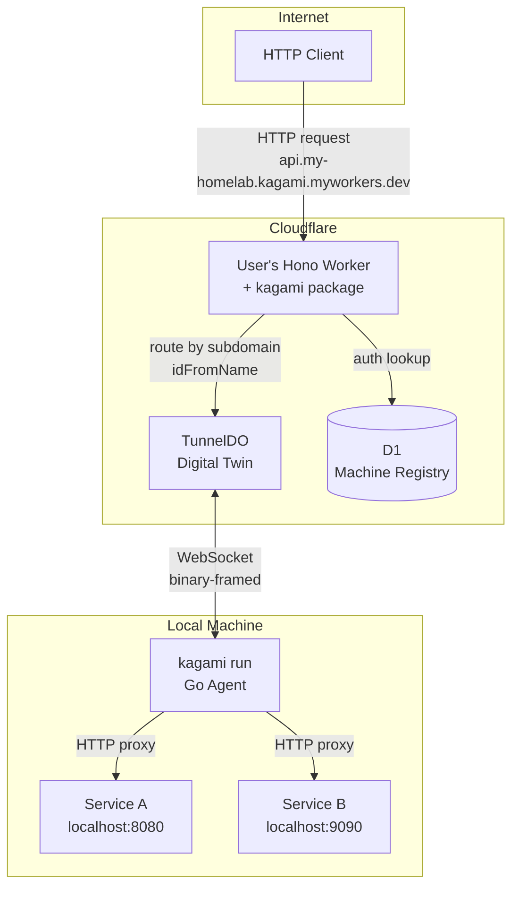
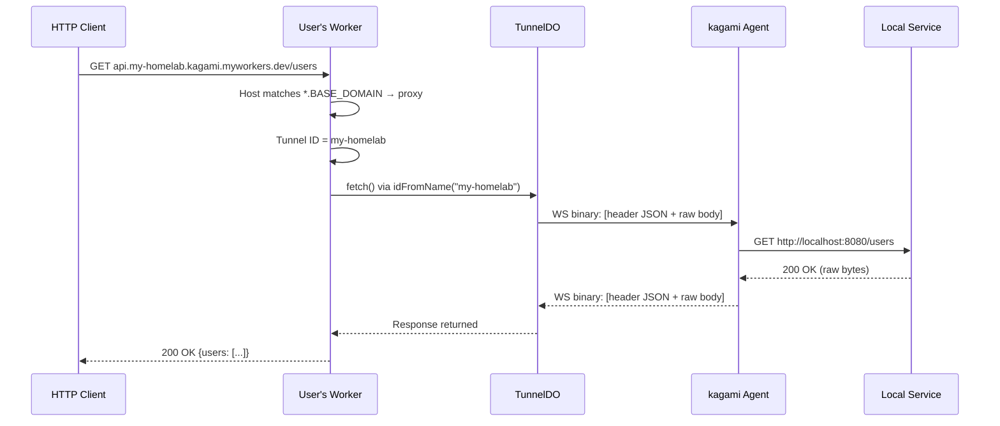
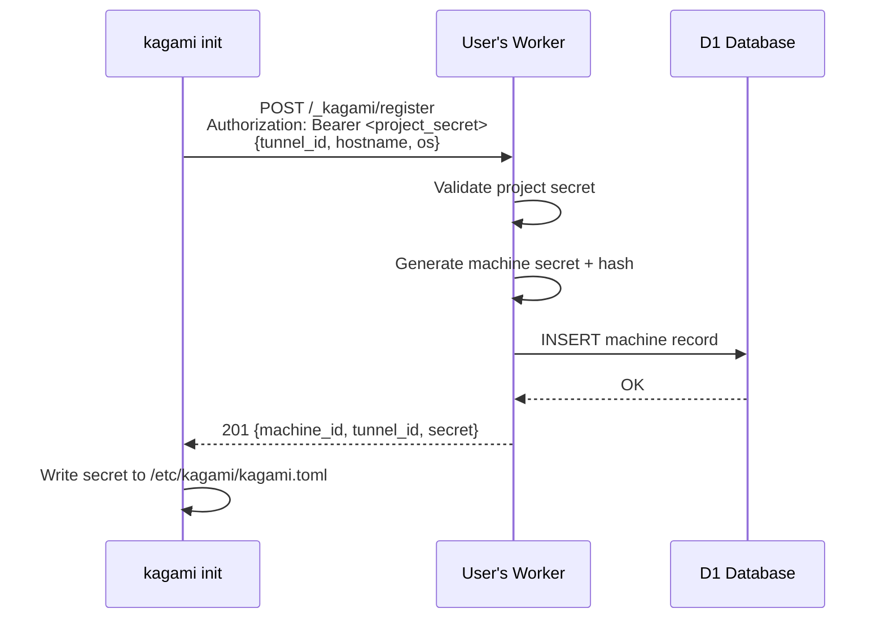
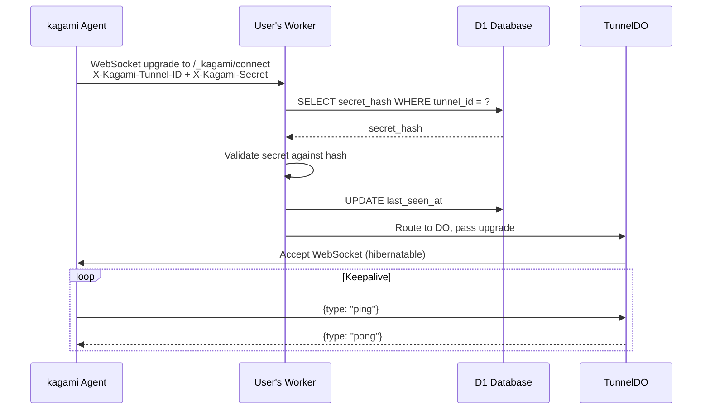

# System Components

## Architecture Overview



## NPM Package (`packages/kagami/`)

**Published as**: `kagami` on npm
**Runtime**: Cloudflare Workers with Hono framework
**Language**: TypeScript

### Exports

- **`createKagami(config?)`** — returns `{ routes, proxy }` for integration into user's Hono app
- **`TunnelDO`** — Durable Object class (user re-exports from their Worker entry point)

### Key Components

- **`src/index.ts`** — Package entry point, `createKagami()` factory
- **`src/tunnel-do.ts`** — Durable Object class definition
- **`src/protocol.ts`** — Wire protocol message types and serialization
- **`src/types.ts`** — Management API types (registration, machine info)
- **`src/routes/management.ts`** — Registration and machine management endpoints
- **`src/routes/connect.ts`** — Agent WebSocket upgrade handler
- **`src/middleware/proxy.ts`** — Subdomain proxy middleware

### Proxy Middleware Responsibilities

- Run as Hono middleware on all requests
- Check if `Host` matches `*.BASE_DOMAIN` (subdomain present)
- If subdomain: extract tunnel ID (rightmost label before BASE_DOMAIN), route to DO via `idFromName(tunnelId)`, forward full Host to agent
- If no subdomain: call `next()`, let management routes or user routes handle it

### Management Route Responsibilities

- `POST /_kagami/register` — validate project secret, generate machine secret, store in D1
- `GET /_kagami/connect` — validate machine secret against D1, route WebSocket to DO
- `GET /_kagami/machines` — list registered machines (project secret protected)
- `DELETE /_kagami/machines/:id` — revoke a machine (project secret protected)
- `GET /_kagami/health` — health check

## Durable Object — TunnelDO (`packages/kagami/src/tunnel-do.ts`)

**One instance per machine.** Named by tunnel ID (e.g., `idFromName("my-homelab")`).

### Responsibilities

- Accept kagami agent WebSocket connection (Worker validates machine secret via D1 before routing to DO)
- Use WebSocket Hibernation API (`this.ctx.acceptWebSocket(server)`) for cost efficiency
- Receive external HTTP requests via `fetch()`, enforce body size limits, frame as binary messages, send to agent
- Handle chunking for large bodies (split into multiple WebSocket frames)
- Correlate responses: hold pending HTTP responses keyed by request ID, resolve when agent replies
- Reassemble chunked responses from the agent
- Track agent connection state (connected/disconnected)
- Respond with 502 when agent is not connected

### State Model

- **In-memory (non-durable)**: Map of pending request IDs → response resolvers, agent connection status, chunk buffers
- **WebSocket tags**: Used to identify agent connection
- **Durable Storage**: Not needed for v1 (state is ephemeral per connection)
- **D1** (accessed by Worker, not DO directly): Machine registry for auth

### Hibernation Behavior

The DO uses `this.ctx.acceptWebSocket(server)` (on the `DurableObjectState` context, since the DO class extends `DurableObject`) so Cloudflare can evict it from memory during idle periods. When a message arrives (either external HTTP via `fetch()` or agent WebSocket message via `webSocketMessage()`), the DO is re-instantiated.

**In-memory pending request map is safe for HTTP proxying.** The DO cannot hibernate while a `fetch()` handler is awaiting a response — Cloudflare keeps the DO active for the duration of any in-flight `fetch()` call. Since every proxied HTTP request is an active `fetch()` awaiting a Promise, the pending request map is guaranteed to be in memory for the lifetime of each request.

The DO only hibernates when there are no active `fetch()` calls and no recent WebSocket messages — i.e., the tunnel is idle. On wake, the map starts empty, which is correct (no in-flight requests).

**Note:** This guarantee does NOT extend to future WebSocket passthrough (where an external WS client connects and messages flow over time). That case will need durable storage for correlation. See Non-Goals in overview.md.

## Go Agent (`cmd/kagami/`)

**Single binary**, multiple subcommands via cobra or similar.

### Subcommands

| Command | Description |
|---------|-------------|
| `kagami run` | Start the tunnel agent (foreground, systemd calls this) |
| `kagami init` | Interactive setup: asks for Worker URL, project secret, machine name; registers with Worker; writes config |
| `kagami project-secret` | Generate a random project secret and print setup instructions |
| `kagami install` | Generate and install systemd unit file, enable service |
| `kagami uninstall` | Stop service, disable, remove unit file |
| `kagami start` | `systemctl start kagami` |
| `kagami stop` | `systemctl stop kagami` |
| `kagami restart` | `systemctl restart kagami` |
| `kagami status` | Show tunnel connection status |
| `kagami tunnel list` | List configured tunnels from config |
| `kagami tunnel add` | Add a tunnel entry to config |
| `kagami tunnel remove` | Remove a tunnel entry from config |

### `kagami project-secret` Flow

1. Generate a cryptographically random secret (e.g., `kgm_proj_<random>`)
2. Print the secret and instructions:
   ```
   Generated project secret:
     kgm_proj_aBcDeFgHiJkLmNoPqRsTuVwXyZ123456

   Set this in your Cloudflare Worker:
     wrangler secret put KAGAMI_PROJECT_SECRET
   ```

### `kagami init` Flow

1. Prompt for Worker URL (e.g., `https://kagami.myworkers.dev`)
2. Prompt for project secret
3. Prompt for machine name (tunnel ID, e.g., `my-homelab`)
4. Detect hostname and OS automatically
5. Call `POST <worker_url>/_kagami/register` with project secret and machine info
6. Receive per-machine secret in response
7. Write config to `/etc/kagami/kagami.toml` (or `--config` path)
8. Print success message and next steps (adding tunnels)

### Internal Packages (`internal/`)

- **`internal/config/`** — TOML config parsing and validation
- **`internal/tunnel/`** — WebSocket client, connection management, reconnection logic
- **`internal/proxy/`** — HTTP reverse proxy to local services
- **`internal/protocol/`** — Wire protocol message types and serialization (mirrors `packages/kagami/src/protocol.ts`)
- **`internal/service/`** — systemd unit file generation and management

## Wire Protocol

WebSocket binary frames using a hybrid format: a small JSON metadata header (with `type`, `id`, and request/response fields) followed by raw body bytes. Large bodies are chunked across multiple frames. See [interface.md](./interface.md) for the frame format and type definitions.

### Request Flow



### Registration Flow



### Agent Connection Flow



## systemd Integration

### Unit File (`/etc/systemd/system/kagami.service`)

Generated by `kagami install`. Runs as a dedicated system service.

### Behavior

- `Type=simple` — kagami run stays in foreground
- `Restart=always` with `RestartSec=5` — auto-restart on crash
- `After=network-online.target` — wait for network
- `ConfigurationDirectory=kagami` — systemd provides `/etc/kagami/`
- Agent handles reconnection internally (exponential backoff on WS disconnect)
